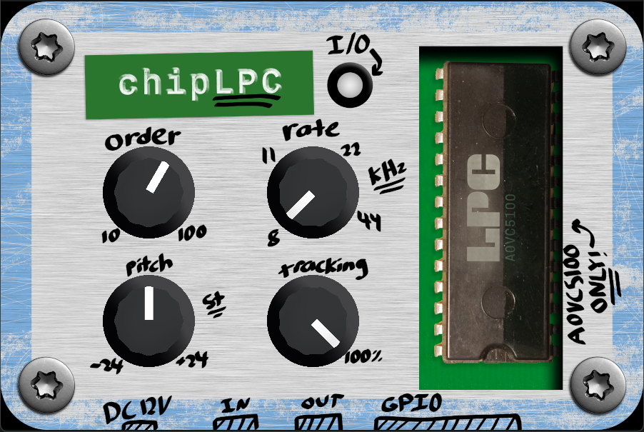

  
   
  <h3>An easy-to-use VST3 effect for LPC (linear predictive coding) voice processing.</h3>

 

<h2>What is this?</h2>

**chipLPC is designed to approximate the sound of early Texas Instruments ICs that used LPC, such as those used in the Speak n' Spell.** The goal of this plugin is to be a meaningful expansion on the current offerings: [BitSpeek](https://soniccharge.com/bitspeek) and [lpc.lv2](https://github.com/lewark/lpc.lv2). BitSpeek offers a good selection of features and a snazzy UI, but I felt like the user experience could be successfully simplified while retaining enough features to be useful. I also thought a FOSS alternative would be nice, especially considering the price tag. lpc.lv2 has been on my radar for a while now, but my prior attempts to get it working on Windows failed. This project started as a port of lpc.lv2 but now uses a custom implementation to both improve performance and enable licensing the code under MIT-0 (as lpc.lv2 is licensed under GPL 3.0). The UI design is also original and all assets are licensed under CC0. All dependancies of this project are GPL-free, and so the binaries should be as well. See [here](https://github.com/EuphoricPenguin/nih-plug-vst3) for more info.

<h2>How do I use it?</h2>

The default values should yield a gritty retro sound, but this plugin can yield a farily wide array of sounds:

- Order: Increase this to capture more formants and vocal detail; decrease it to do the opposite

- Rate: This changes the bitrate, which controls the "gritiness"

- Pitch: A simple pitch shift

- Tracking: This controls the level of pitch tracking; setting this to 0% yields a robotic monotone sound

<h2>How do I install it or build it?</h2>

The [Releases](https://github.com/EuphoricPenguin/chipLPC/releases) page has binaries built for Windows, but you should be able to build the source for other platforms.

After installing the Rustup, Rust, and the proper toolchain for your platform, running `cargo build` should yield a usable binary file.

<h2>Extra Info</h2>
Original UI design by me and licensed under CC0. 
Built using Rust with NIH-Plug and egui. Created using Cline and MiniMax-M2.5, plus Gemini 3.1 Pro for implementation advice. All first-party code licensed under MIT-0. Third-party licenses apply to binary files: see THIRDPARTY.yml for more info.